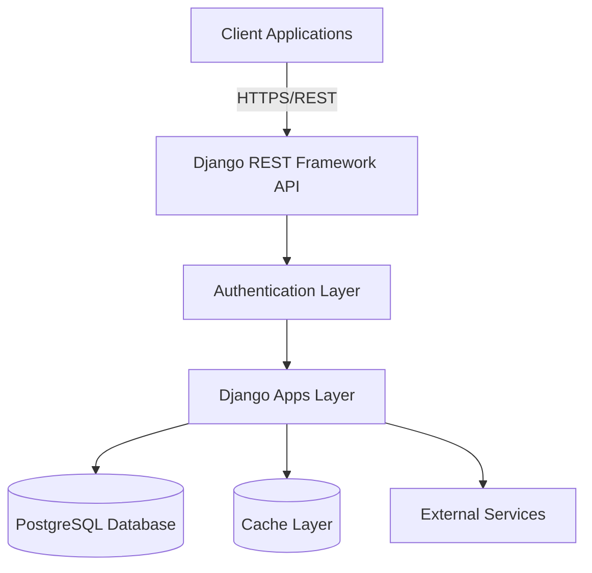
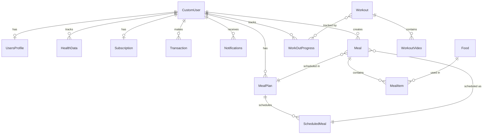
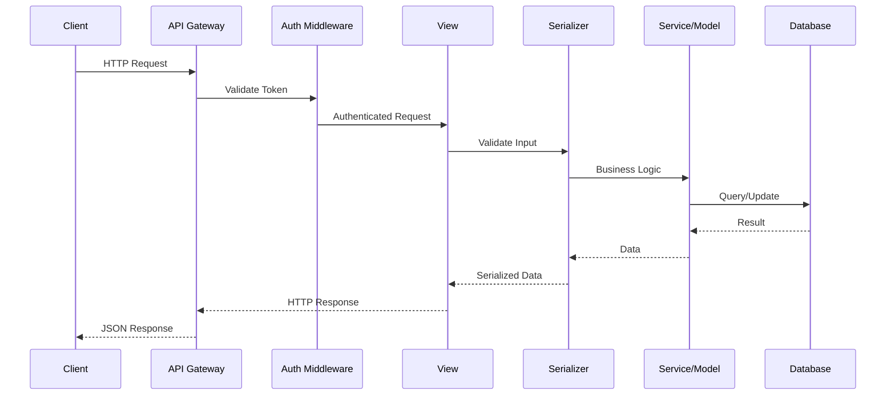
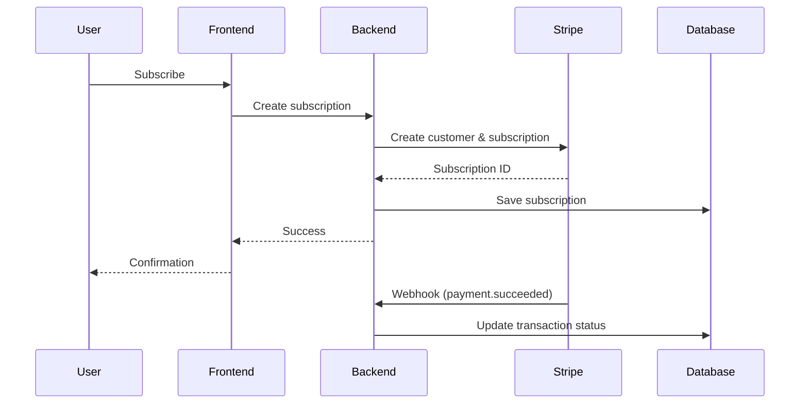

# FitCore - System Architecture Documentation

## Table of Contents
1. [System Overview](#system-overview)
2. [Architecture Patterns](#architecture-patterns)
3. [Layer Architecture](#layer-architecture)
4. [Django Apps Architecture](#django-apps-architecture)
5. [Database Architecture](#database-architecture)
6. [API Architecture](#api-architecture)
7. [Authentication & Authorization](#authentication--authorization)
8. [External Services Integration](#external-services-integration)
9. [Data Flow](#data-flow)
10. [Security Architecture](#security-architecture)
11. [Scalability & Performance](#scalability--performance)
12. [Technology Stack](#technology-stack)

---

## System Overview

FitCore is an AI-powered fitness application built using Django and Django REST Framework. The system follows a **monolithic architecture** with modular Django apps, providing a robust backend API for mobile (iOS/Android) and web clients.

### Core Capabilities
- **User Management**: Registration, authentication, profile management
- **Workout Management**: Video-based workout programs with progress tracking
- **Nutrition Management**: AI-generated and manual meal planning
- **Health Tracking**: Integration with health data from various sources
- **Payment Processing**: Subscription and one-time payment handling
- **Notifications**: Multi-channel notification delivery
- **Admin Dashboard**: Content and user management interface

---

## Architecture Patterns

### 1. **Monolithic Modular Architecture**
The application follows a modular monolithic pattern where each Django app represents a bounded context with specific responsibilities.



### 2. **Layered Architecture**
The system is organized into distinct layers:

```
┌─────────────────────────────────────────────┐
│         Presentation Layer                  │
│  (Views, Serializers, URL Routing)          │
├─────────────────────────────────────────────┤
│         Business Logic Layer                │
│  (Services, Models, Permissions)            │
├─────────────────────────────────────────────┤
│         Data Access Layer                   │
│  (Django ORM, Model Managers)               │
├─────────────────────────────────────────────┤
│         Infrastructure Layer                │
│  (Database, Cache, External APIs)           │
└─────────────────────────────────────────────┘
```

---

## Layer Architecture

### Presentation Layer
**Components**: Views, Serializers, URL Configuration

**Responsibilities**:
- Handle HTTP requests and responses
- Request validation and serialization
- Response formatting
- URL routing

**Key Files**:
- `*/views.py` - API endpoints and view logic
- `*/serializers.py` - Data serialization/deserialization
- `*/urls.py` - URL routing configuration

### Business Logic Layer
**Components**: Models, Services, Permissions, Signals

**Responsibilities**:
- Core business logic implementation
- Data validation and processing
- Business rules enforcement
- Event handling through signals

**Key Files**:
- `*/models.py` - Data models and business entities
- `*/services.py` - Business logic services
- `*/permission.py` - Custom permissions
- `*/signals.py` - Event-driven logic

### Data Access Layer
**Components**: Django ORM, Custom Managers, QuerySets

**Responsibilities**:
- Database queries and operations
- Data persistence
- Custom query logic
- Database transactions

**Key Files**:
- `*/models.py` - ORM models
- `*/managers.py` - Custom model managers

### Infrastructure Layer
**Components**: Database, Cache, External Services

**Responsibilities**:
- PostgreSQL database
- Media storage (local/cloud)
- External API integrations
- Caching mechanisms

---

## Django Apps Architecture

The application consists of 8 modular Django apps, each with specific responsibilities:

### 1. **users** - User Management Service
**Purpose**: Core user authentication and profile management

**Models**:
- `CustomUser` - Extended Django user model (email-based authentication)
- `UsersProfile` - Extended user profile (age, weight, height, gender, fitness goals)

**Key Features**:
- Custom user manager for email-based authentication
- Profile auto-creation via signals
- User settings and preferences management

**API Endpoints**:
- User registration and authentication
- Profile CRUD operations
- User settings management
- Dashboard data aggregation

### 2. **authapp** - Authentication Service
**Purpose**: Extended authentication functionality

**Responsibilities**:
- OAuth integration (Google, Apple)
- Token management (JWT)
- Password reset workflows
- Social authentication

**Dependencies**:
- `dj-rest-auth`
- `django-allauth`
- `rest_framework_simplejwt`

### 3. **meal** - Nutrition Management Service
**Purpose**: Meal planning and nutrition tracking

**Models**:
- `Food` - Food items with nutritional information
- `Meal` - Meal compositions with multiple foods
- `MealItem` - Junction table for meal-food relationship
- `MealPlan` - User meal plans (daily/weekly)
- `ScheduledMeal` - Scheduled meals within plans

**Key Features**:
- Manual meal creation
- AI-generated meal plans
- Nutritional calculations (calories, macros)
- Template meals for reuse
- Food database with serving sizes

**Business Logic**:
- Automatic nutritional aggregation via properties
- Support for custom user foods
- Public food database for all users

### 4. **workout** - Workout Management Service
**Purpose**: Workout content and progress tracking

**Models**:
- `Workout` - Workout programs with metadata
- `WorkoutVideo` - Video content for workouts
- `WorkOutProgress` - User workout progress tracking

**Key Features**:
- Categorized workout programs
- Difficulty levels
- Premium/free content segregation
- Video ordering and organization
- Progress tracking with completion percentage
- Automatic completion timestamp

**Business Logic**:
- Auto-complete detection (100% progress)
- Many-to-many relationship for user-workout tracking

### 5. **health** - Health Data Integration Service
**Purpose**: Health metrics tracking and device integration

**Models**:
- `HealthData` - Time-series health metrics

**Key Features**:
- Manual health data entry
- Health data sync (Google Fit, Apple HealthKit)
- Various health metric types
- Timestamped data points

**Integration Points**:
- Google Fit API
- Apple HealthKit API

### 6. **payment** - Payment Processing Service
**Purpose**: Subscription and payment management

**Models**:
- `Subscription` - User subscription status and plans
- `Transaction` - Payment transaction ledger

**Key Features**:
- Monthly and lifetime subscription plans
- Subscription status management (active, inactive, cancelled, past due)
- Payment gateway integration (Stripe, PayPal)
- Transaction history and audit trail
- Webhook handling for payment events

**Business Logic**:
- Access control via `has_active_access` property
- One subscription per user (OneToOne relationship)
- Automatic end date calculation for monthly plans

### 7. **notification** - Notification Service
**Purpose**: User notification management

**Models**:
- `Notifications` - User notifications

**Key Features**:
- Multi-type notifications
- Read/unread status tracking
- Notification history
- Push notification integration

**Notification Types**:
- System alerts
- Workout reminders
- Meal plan updates
- Payment notifications

### 8. **adminapp** - Admin Management Service
**Purpose**: Administrative functions and content management

**Key Features**:
- Enhanced admin interface (Jazzmin)
- Content management (workouts, meals, videos)
- User management
- Analytics and reporting

---

## Database Architecture

### Database Design Principles
1. **Normalization**: 3NF normalized schema
2. **Referential Integrity**: Foreign key constraints
3. **Soft Deletes**: Using status fields instead of hard deletes
4. **Audit Trail**: Created/updated timestamps on key models

### Entity Relationships



### Key Relationships

**User-Centric Design**:
- User is the central entity
- OneToOne: User ↔ Profile, User ↔ Subscription
- OneToMany: User → HealthData, Meals, Notifications, Transactions
- ManyToMany: User ↔ Workouts (through WorkOutProgress)

**Meal Planning**:
- MealPlan contains multiple Meals via ScheduledMeal
- Meal contains multiple Foods via MealItem
- Support for both user-created and template meals

**Workout Structure**:
- Workout contains multiple WorkoutVideos
- Videos ordered by index for sequencing
- Premium/free access control at video level

**Payment Tracking**:
- Subscription tracks current plan status
- Transaction logs all payment events
- Support for multiple payment gateways

### Database Schema Highlights

**Users & Profiles**:
```
CustomUser (AUTH_USER)
├── email (unique, primary auth field)
├── is_active, is_staff, is_superuser
└── UsersProfile (OneToOne)
    ├── age, weight, height, gender
    ├── fitness_goal
    └── profile_image
```

**Meal Management**:
```
MealPlan
├── user (FK)
├── goal, duration_days, start_date
├── target_daily_calories, protein, carbs, fat
├── is_ai_generated, is_template
└── ScheduledMeal
    ├── meal (FK)
    ├── day_of_plan
    └── Meal
        ├── meal_time_category
        └── MealItem
            ├── food (FK)
            └── number_of_servings
```

**Workout & Progress**:
```
Workout
├── title, description, duration
├── difficulty, category, goals
├── is_premium
├── WorkoutVideo (OneToMany)
│   ├── video_file, thumbnail
│   ├── order_index
│   └── is_free
└── WorkOutProgress (ManyToMany through table)
    ├── user (FK)
    ├── completed_at
    └── progress_percentage
```

**Payment System**:
```
Subscription (OneToOne with User)
├── plan (MONTHLY/LIFETIME)
├── status (ACTIVE/INACTIVE/CANCELLED/PAST_DUE)
├── start_date, end_date
├── gateway, gateway_subscription_id
└── Transaction (OneToMany)
    ├── plan_at_purchase
    ├── amount, currency
    ├── status, gateway
    ├── gateway_transaction_id
    └── gateway_response (JSON)
```

---

## API Architecture

### API Design Principles
1. **RESTful Design**: Resource-based URLs
2. **Versioning**: `/api/v1/` prefix for version control
3. **Consistent Response Format**: Standardized JSON responses
4. **Pagination**: Cursor/offset pagination for list endpoints
5. **Filtering**: Django-filter integration
6. **Authentication**: JWT token-based authentication

### API Structure

```
/api/v1/
├── auth/                    # Authentication endpoints
│   ├── register/
│   ├── login/
│   ├── oauth/
│   └── password-reset/
├── users/                   # User management
│   ├── profile/
│   ├── settings/
│   ├── dashboard/
│   └── favorites/
├── nutrition/               # Meal & nutrition
│   ├── meals/
│   ├── plans/
│   ├── foods/
│   └── generate/
├── workouts/                # Workout content
│   ├── workouts/
│   ├── videos/
│   ├── categories/
│   └── progress/
├── health/                  # Health data
│   ├── data/
│   ├── metrics/
│   └── sync/
├── payments/                # Payment processing
│   ├── subscriptions/
│   ├── transactions/
│   └── webhooks/
└── notifications/           # Notifications
    ├── list/
    ├── settings/
    └── subscribe/
```

### Request/Response Flow



### Authentication Flow

**JWT Token-Based Authentication**:
```
1. User Login → POST /api/v1/auth/login/
2. Server validates credentials
3. Server generates JWT tokens:
   - Access Token (30 min lifetime)
   - Refresh Token (stored in HTTP-only cookie)
4. Client stores access token
5. Client includes token in Authorization header
6. Server validates token on each request
7. Token refresh when expired → POST /api/v1/auth/refresh/
```

**OAuth Flow (Google/Apple)**:
```
1. Client initiates OAuth → Redirect to provider
2. User authenticates with provider
3. Provider redirects with authorization code
4. Backend exchanges code for tokens
5. Backend creates/updates user account
6. Backend returns JWT tokens
```

---

## Authentication & Authorization

### Authentication System

**Components**:
- **Django Authentication Backend**: Custom email-based authentication
- **JWT Tokens**: `rest_framework_simplejwt`
- **OAuth Integration**: `django-allauth` (Google, Apple)
- **Token Storage**: HTTP-only cookies for refresh tokens

**Configuration** (`settings.py`):
```python
REST_AUTH = {
    'USE_JWT': True,
    'JWT_AUTH_COOKIE': 'fitcore-access-token',
    'JWT_AUTH_REFRESH_COOKIE': 'fitcore-refresh-token',
}

SIMPLE_JWT = {
    "ACCESS_TOKEN_LIFETIME": timedelta(minutes=30),
    "REFRESH_TOKEN_LIFETIME": timedelta(days=7),
    "ROTATE_REFRESH_TOKENS": True,
    "BLACKLIST_AFTER_ROTATION": True,
}
```

### Authorization Levels

1. **Anonymous Users**:
   - Access to public workout previews
   - Registration and login endpoints

2. **Authenticated Users**:
   - Profile management
   - Free workout access
   - Basic meal planning
   - Health data tracking

3. **Subscribed Users (Premium)**:
   - Full workout library access
   - AI-generated meal plans
   - Advanced features

4. **Staff Users**:
   - Admin dashboard access
   - Content management

5. **Superusers**:
   - Full system access
   - User management
   - System configuration

### Permission Architecture

**Custom Permissions**:
- `IsOwner`: User can only access their own resources
- `IsSubscribed`: User has active subscription
- `IsPremium`: Access to premium content
- `IsStaffOrReadOnly`: Staff can modify, others read-only

**Implementation** (`permission.py`):
```python
# Example from meal app
class IsOwnerOrReadOnly(permissions.BasePermission):
    def has_object_permission(self, request, view, obj):
        if request.method in permissions.SAFE_METHODS:
            return True
        return obj.user == request.user
```

---

## External Services Integration

### 1. **OpenAI API** (AI Meal Plan Generation)
**Purpose**: Generate personalized meal plans based on user data

**Integration Flow**:
```
User Request → Collect user profile data (weight, goals, preferences)
           → Format prompt with nutritional requirements
           → Call OpenAI API
           → Parse response
           → Create MealPlan and Meal objects
           → Return structured meal plan
```

### 2. **Payment Gateways**

**Stripe Integration**:
- Subscription management
- Webhook event handling
- Payment method storage
- Invoice generation

**Payment Flow**:


### 3. **Health Data Providers**

**Google Fit Integration**:
- OAuth authentication
- Data sync endpoints
- Metric mapping to HealthData model

**Apple HealthKit Integration**:
- iOS-side data collection
- API endpoints for data upload
- Standardized data format

### 4. **Media Storage**

**Current**: Local file storage
**Future**: AWS S3 or Cloudinary

**Configuration**:
```python
MEDIA_URL = '/media/'
MEDIA_ROOT = BASE_DIR / 'media'

# For production:
# DEFAULT_FILE_STORAGE = 'storages.backends.s3boto3.S3Boto3Storage'
# AWS_STORAGE_BUCKET_NAME = 'fitcore-media'
```

### 5. **Email Service**

**Current**: Console backend (development)
**Future**: SMTP/SendGrid/AWS SES

**Use Cases**:
- Email verification
- Password reset
- Subscription notifications
- Workout reminders

---

## Data Flow

### User Registration Flow
```
1. Client submits registration data
2. CustomUserManager creates user with hashed password
3. Signal triggers UsersProfile creation
4. Email verification sent (if enabled)
5. JWT tokens generated
6. User logged in automatically
```

### Meal Plan Generation Flow (AI)
```
1. User requests AI meal plan
2. System collects user profile data:
   - Weight, height, age, gender
   - Fitness goals
   - Dietary preferences
3. Calculate nutritional requirements
4. Format prompt for OpenAI API
5. Call OpenAI API with user context
6. Parse API response
7. Create MealPlan object
8. Create Meal objects with MealItems
9. Schedule meals across plan duration
10. Return complete meal plan to user
```

### Workout Progress Tracking Flow
```
1. User starts workout
2. Frontend tracks video completion
3. User completes workout session
4. Client sends progress update
5. Update WorkOutProgress model
6. Calculate progress_percentage
7. If 100%, auto-set completed_at timestamp
8. Update user statistics
9. Check achievements/milestones
10. Send notification if milestone reached
```

### Payment Processing Flow
```
1. User selects subscription plan
2. Frontend redirects to payment gateway
3. User completes payment
4. Gateway sends webhook to backend
5. Backend validates webhook signature
6. Create/Update Subscription record
7. Create Transaction record
8. Update user access level
9. Send confirmation email
10. Notify frontend of success
```

---

## Security Architecture

### Security Layers

**1. Application Security**:
- CSRF protection enabled
- XSS protection via Django templates
- SQL injection prevention (Django ORM)
- Input validation via serializers
- Rate limiting (to be implemented)

**2. Authentication Security**:
- Password hashing (PBKDF2 algorithm)
- JWT token expiration
- Refresh token rotation
- Token blacklisting after logout
- OAuth secure flow

**3. Authorization Security**:
- Granular permission checks
- Object-level permissions
- Role-based access control
- Subscription status validation

**4. API Security**:
- HTTPS enforcement (production)
- CORS configuration
- API versioning
- Request validation

**5. Data Security**:
- Database connection encryption
- Sensitive data in environment variables
- Payment data not stored (PCI compliance)
- User data privacy

### CORS Configuration

```python
CORS_ALLOWED_ORIGINS = [
    "http://localhost:3000",  # React Native dev
    "http://localhost:19006",  # Expo dev
]

CORS_ALLOW_CREDENTIALS = True
```

### Middleware Stack

```python
MIDDLEWARE = [
    'django.middleware.security.SecurityMiddleware',
    'django.contrib.sessions.middleware.SessionMiddleware',
    'corsheaders.middleware.CorsMiddleware',  # CORS
    'django.middleware.common.CommonMiddleware',
    'django.middleware.csrf.CsrfViewMiddleware',
    'django.contrib.auth.middleware.AuthenticationMiddleware',
    'django.contrib.messages.middleware.MessageMiddleware',
    'django.middleware.clickjacking.XFrameOptionsMiddleware',
    'allauth.account.middleware.AccountMiddleware',  # OAuth
]
```

### Security Best Practices Implemented

✅ Custom user model with email authentication
✅ JWT token-based authentication
✅ CORS protection
✅ CSRF protection
✅ SQL injection prevention (ORM)
✅ Password hashing
✅ HTTPS configuration (production)
✅ Environment variables for secrets
✅ Permission-based access control

### Security Recommendations

📌 Implement rate limiting (Django ratelimit)
📌 Add API throttling (DRF throttling)
📌 Implement request signing for webhooks
📌 Add security headers (django-security)
📌 Regular dependency updates
📌 Security audit logging
📌 Implement 2FA (optional)
📌 Add reCAPTCHA for registration

---

## Scalability & Performance

### Current Architecture Characteristics

**Strengths**:
- Modular app structure enables horizontal scaling
- Stateless API (JWT) supports load balancing
- PostgreSQL supports read replicas
- Django ORM provides query optimization

**Limitations**:
- Monolithic deployment
- Single database instance
- No caching layer implemented
- Synchronous request processing

### Scalability Strategies

**1. Database Optimization**:
```python
# Query optimization
- Use select_related() for foreign keys
- Use prefetch_related() for many-to-many
- Database indexing on frequently queried fields
- Query result caching

# Example:
meals = Meal.objects.select_related('user')\
    .prefetch_related('mealitem_set__food')\
    .filter(user=request.user)
```

**2. Caching Strategy**:
```python
# Redis caching (to be implemented)
CACHES = {
    'default': {
        'BACKEND': 'django_redis.cache.RedisCache',
        'LOCATION': 'redis://127.0.0.1:6379/1',
    }
}

# Cache user profiles, meal plans, workout data
# Cache invalidation on updates
```

**3. Horizontal Scaling**:
```
┌─────────────┐
│Load Balancer│
└──────┬──────┘
       │
   ┌───┴───┬───────┬───────┐
   │       │       │       │
┌──▼──┐ ┌──▼──┐ ┌──▼──┐ ┌──▼──┐
│App 1│ │App 2│ │App 3│ │App N│
└──┬──┘ └──┬──┘ └──┬──┘ └──┬──┘
   │       │       │       │
   └───┬───┴───┬───┴───┬───┘
       │       │       │
    ┌──▼───────▼───────▼──┐
    │   PostgreSQL DB     │
    │   (Primary/Replica) │
    └─────────────────────┘
```

**4. Asynchronous Processing**:
```python
# Celery for background tasks
- AI meal plan generation
- Email sending
- Video processing
- Notification delivery
- Analytics calculation

# Example task:
@shared_task
def generate_ai_meal_plan(user_id, preferences):
    # Long-running AI generation
    pass
```

**5. Media Storage Optimization**:
```
- Use CDN for video delivery
- Implement video transcoding
- Multiple quality levels
- Progressive video loading
- Image optimization and compression
```

**6. Database Sharding** (Future):
```
- Shard by user_id
- Separate read/write operations
- Use database routers
```

### Performance Optimization

**Query Optimization**:
```python
# Use aggregations instead of Python loops
from django.db.models import Sum, Count

# Bad
total_calories = sum(meal.total_calories for meal in meals)

# Good
total_calories = meals.aggregate(
    total=Sum('mealitem__food__calories')
)['total']
```

**Pagination**:
```python
# Implement cursor pagination for large datasets
REST_FRAMEWORK = {
    'DEFAULT_PAGINATION_CLASS': 
        'rest_framework.pagination.CursorPagination',
    'PAGE_SIZE': 20
}
```

**Lazy Loading**:
```python
# Implement lazy loading for videos
# Load metadata first, stream video on demand
# Use video thumbnail for preview
```

### Monitoring & Performance Metrics

**Key Metrics to Track**:
- API response time
- Database query time
- Error rates
- Active users
- Video streaming performance
- Payment success rates
- AI generation time

**Tools** (to be implemented):
- Django Debug Toolbar (development)
- New Relic / DataDog (production)
- PostgreSQL query analyzer
- Application Performance Monitoring (APM)

---

## Technology Stack

### Backend Framework
- **Django 5.2**: Web framework
- **Django REST Framework**: API development
- **PostgreSQL**: Primary database

### Authentication & Authorization
- **Simple JWT**: JWT token management
- **dj-rest-auth**: REST authentication
- **django-allauth**: Social authentication
- **Google/Apple OAuth**: Social login

### API & Serialization
- **Django REST Framework**: RESTful API
- **django-filter**: API filtering
- **DRF renderers**: JSON/XML response formatting

### Payment Processing
- **Stripe API**: Payment processing
- **Webhook handling**: Payment events

### Media & Storage
- **Django file storage**: Media handling
- **Pillow**: Image processing
- **Future**: AWS S3 / Cloudinary

### AI Integration
- **OpenAI API**: Meal plan generation

### Admin Interface
- **Jazzmin**: Enhanced Django admin
- **Django admin**: Content management

### Frontend (Separate Repository)
- **React Native**: Mobile apps (iOS/Android)
- **HTML/CSS/JavaScript**: Admin dashboard

### Development Tools
- **Python 3.x**: Programming language
- **pip**: Package management
- **Git**: Version control

### Deployment Stack (Production)
- **Gunicorn/uWSGI**: WSGI server
- **Nginx**: Reverse proxy
- **PostgreSQL**: Database
- **Redis**: Caching (future)
- **Celery**: Background tasks (future)
- **Docker**: Containerization (optional)

### Monitoring & Logging
- **Django logging**: Application logs
- **PostgreSQL logs**: Database monitoring

---

## Deployment Architecture

### Development Environment
```
- DEBUG = True
- SQLite or local PostgreSQL
- Console email backend
- Local media storage
- Development server (manage.py runserver)
```

### Production Environment
```
┌──────────────────┐
│   Load Balancer  │
│   (Nginx/ALB)    │
└────────┬─────────┘
         │
    ┌────▼────┐
    │ Gunicorn│
    │ Workers │
    └────┬────┘
         │
┌────────▼────────┐
│  Django App     │
│  (FitCore)      │
└────┬───────┬────┘
     │       │
┌────▼───┐  │  ┌──────────┐
│Postgres│◄─┘  │  Redis   │
│   DB   │     │  Cache   │
└────────┘     └──────────┘
     │
┌────▼───────────┐
│  AWS S3/CDN    │
│  (Media)       │
└────────────────┘
```

### Configuration Management
```python
# settings.py structure
- settings/base.py       # Common settings
- settings/development.py # Dev-specific
- settings/production.py  # Prod-specific
- settings/testing.py     # Test-specific

# Environment variables
- DATABASE_URL
- SECRET_KEY
- STRIPE_API_KEY
- OPENAI_API_KEY
- AWS_ACCESS_KEY_ID
- AWS_SECRET_ACCESS_KEY
```

---

## Future Enhancements

### Architecture Evolution

**Phase 1: Current State** (Monolithic)
- Single Django application
- All apps in one codebase
- Shared database

**Phase 2: Microservices** (Future)
```
┌──────────────┐
│ API Gateway  │
└──────┬───────┘
       │
   ┌───┴────────────────────────┐
   │                            │
┌──▼──────────┐      ┌──────────▼─┐
│Auth Service │      │User Service│
└─────────────┘      └────────────┘
       │                    │
┌──────▼────────┐  ┌────────▼────┐
│Workout Service│  │Meal Service │
└───────────────┘  └─────────────┘
       │                    │
┌──────▼────────┐  ┌────────▼────┐
│Payment Service│  │Health Service│
└───────────────┘  └─────────────┘
```

### Planned Improvements

**Technical**:
- [ ] Implement Redis caching
- [ ] Add Celery for async tasks
- [ ] Implement rate limiting
- [ ] Add API versioning strategy
- [ ] GraphQL API (optional)
- [ ] Elasticsearch for search
- [ ] Real-time notifications (WebSocket)

**Features**:
- [ ] Social features (friend connections)
- [ ] Workout plans (multi-day programs)
- [ ] Progress photos
- [ ] Community features
- [ ] Workout challenges
- [ ] Nutrition scanner (OCR)
- [ ] Wearable device integration

**Infrastructure**:
- [ ] Docker containerization
- [ ] Kubernetes orchestration
- [ ] CI/CD pipeline
- [ ] Automated testing
- [ ] Load testing
- [ ] Security scanning

---

## Conclusion

The FitCore architecture is designed as a modular monolithic application with clear separation of concerns. Each Django app represents a bounded context with specific responsibilities, making the codebase maintainable and scalable. The system follows RESTful API design principles and implements industry-standard security practices.

### Key Architectural Strengths
✅ Modular app structure
✅ Clear layer separation
✅ RESTful API design
✅ JWT-based authentication
✅ Comprehensive data model
✅ Payment integration ready
✅ AI integration capability
✅ Scalable foundation

### Architecture Principles Followed
- **Separation of Concerns**: Each app has specific responsibilities
- **DRY (Don't Repeat Yourself)**: Reusable components and utilities
- **SOLID Principles**: Object-oriented design
- **RESTful Design**: Resource-based API architecture
- **Security First**: Authentication, authorization, and data protection
- **Scalability**: Horizontal scaling capability
- **Maintainability**: Clean code and documentation

This architecture provides a solid foundation for the FitCore application while allowing for future growth and evolution toward a microservices architecture if needed.

---

## References

- [Django Documentation](https://docs.djangoproject.com/)
- [Django REST Framework](https://www.django-rest-framework.org/)
- [FitCore README](./README.md)
- [FitCore ERD](./FitCore%20ERD%20.png)
- [Simple JWT Documentation](https://django-rest-framework-simplejwt.readthedocs.io/)
- [django-allauth Documentation](https://django-allauth.readthedocs.io/)

---

**Document Version**: 1.0  
**Last Updated**: 2024  
**Maintained By**: FitCore Development Team
